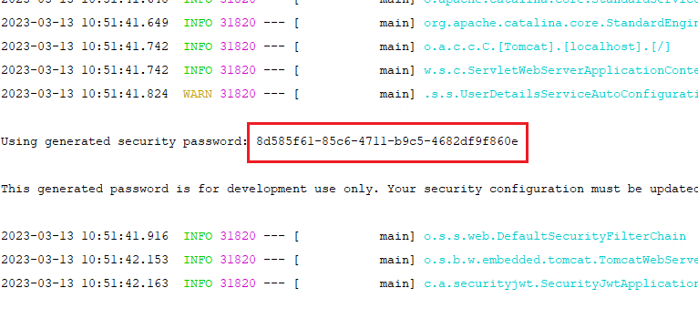
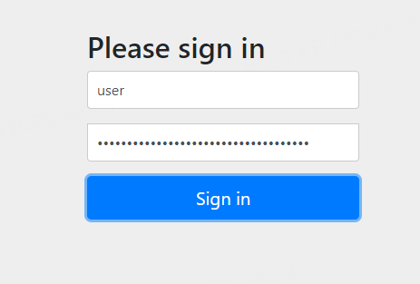
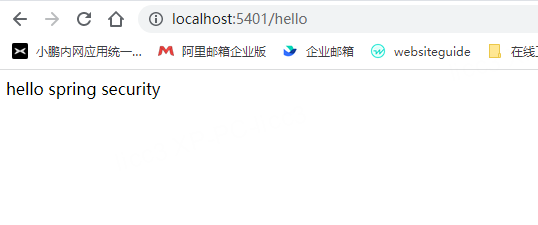
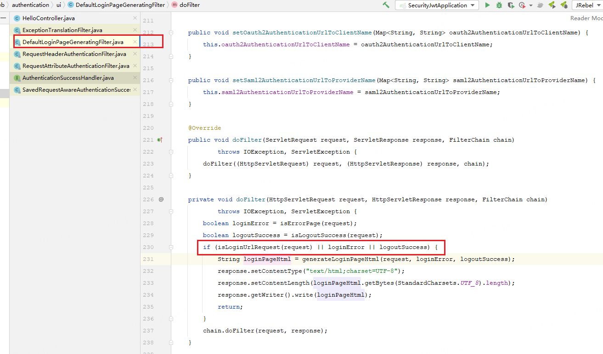
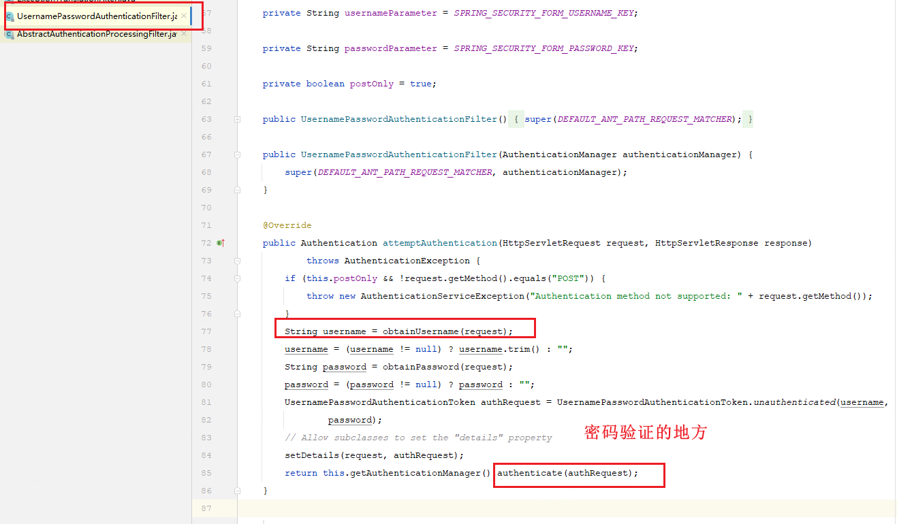
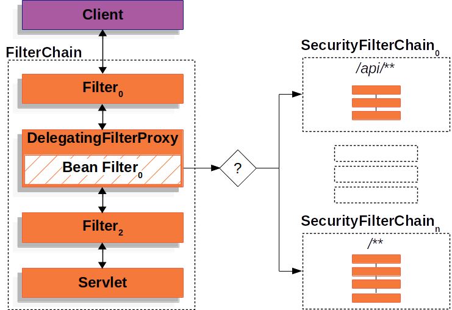
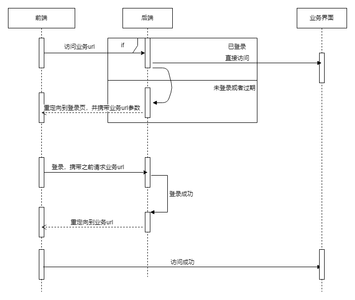
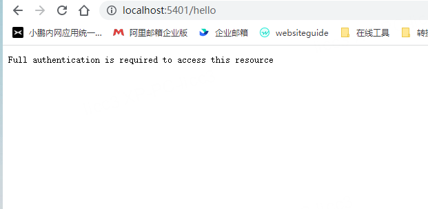
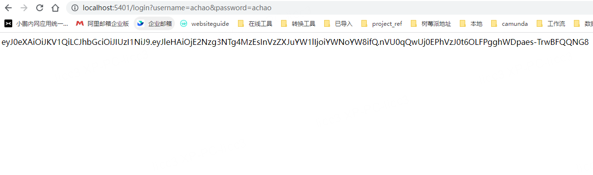
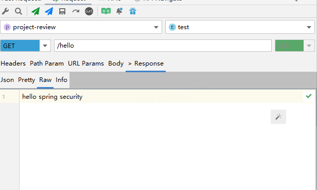

# Spring Security 搭配JWT使用

本文档由个人整理，参考官方文档[Spring Security 中文文档](http://docs.jcohy.com/docs/spring-security/5.3.6.RELEASE/html5/zh-cn/index.html#servlet-hello-starting)。

## 一、简单入门

### 1.1 引入依赖

在搭建好springBoot项目之后，引入maven依赖, 这里使用的springboot是2.7.6版本。

```xml
        <dependency>
            <groupId>org.springframework.boot</groupId>
            <artifactId>spring-boot-starter-security</artifactId>
        </dependency>
```

### 1.2 启动服务，访问/hello。

    按照官方的说法，此时默认会重定向到一个表单登录的界面。启动时有日志告诉你临时生成的密码。



    但是没有找到默认的登录名称，通过debug `InMemoryUserDetailsManager`, 得到默认的用户名为user。



登录成功后，重定型到/hello页面



### 1.3 过程分析

    上面的过程中，spring security默认帮我们做了登录拦截，认证，重定向等工作。关于登录拦截，首先会通过`DefaultLoginPageGeneratingFilter`跳转到登录页面



之后，对/login提交的登录表单，使用`UsernamePasswordAuthenticationFilter`拦截器处理。



spring security使用`AuthenticationManager`-> `ProviderManager` -> `AuthenticationProvider`来进行认证。整个过程如官方图例



## 二、集成JWT

    前后端分离的项目中，因为前端域名和请求的后端域名是分开的，所以在前端请求token的请求失败后，后端只能重定向到协商好的登录页面，登录成功后，仍然需要前端传递之前请求的业务界面。所以，这些工作需要前后端多协商。



### 2.1 JWT请求接口

    这里采用的是账号密码的登录方式，接口用来生产JWT字符串，并设置token到spring Security上下文当中。

```java
    @GetMapping("/login")
    public String login(@RequestParam("username") String username, @RequestParam("password") String password) {
        UserDetails userDetails = jwtUserDetailsService.loadUserByUsername(username);
        if (!ObjectUtils.nullSafeEquals(userDetails.getPassword(), password)) {
            throw new RuntimeException("用户名或者密码不正确！");
        }
        // 用户名密码验证成功
        UsernamePasswordAuthenticationToken authenticationToken = new UsernamePasswordAuthenticationToken(username, password);
        // 这里有认证信息，表示验证已通过
        SecurityContextHolder.getContext().setAuthentication(authenticationToken);
        return JWTUtil.sign(username , password);
    }
```

jwtUtil

```java
public class JWTUtil {

    private static final Logger log = LoggerFactory.getLogger(JWTUtil.class);

    // 过期时间5分钟
    private static final long EXPIRE_TIME = 5 * 60 * 1000;

    /**
     * 生成签名,5min后过期
     *
     * @param username 用户名
     * @param secret   用户的密码
     * @return 加密的token
     */
    public static String sign(String username, String secret) {
        Date date = new Date(System.currentTimeMillis() + EXPIRE_TIME);
        Algorithm algorithm = Algorithm.HMAC256(secret);
        // 附带username信息
        return JWT.create()
                .withClaim("username", username)
                .withExpiresAt(date)
                .sign(algorithm);
    }

    /**
     * 校验token是否正确
     *
     * @param token  密钥
     * @param secret 用户的密码
     * @return 是否正确
     */
    public static boolean verify(String token, String username, String secret) {
        Algorithm algorithm = Algorithm.HMAC256(secret);
        JWTVerifier verifier = JWT.require(algorithm)
                .withClaim("username", username)
                .build();
        DecodedJWT jwt = verifier.verify(token);
        return true;
    }

    /**
     * 获得token中的信息无需secret解密也能获得
     *
     * @return token中包含的用户名
     */
    public static String getUsername(String token) {
        DecodedJWT jwt = JWT.decode(token);
        return jwt.getClaim("username").asString();
    }

    public static String getHeader() {
        return "JWTName";
    }
}
```

### 2.2 认证拦截

    自定义JWT拦截器，对携带的token进行合法性验证，如是否过期，是否被篡改。

```java
@Component
public class JwtAuthenticationTokenFilter extends OncePerRequestFilter{

    @Resource
    private JWTUserDetailsService jwtUserDetailsService;

    @Override
    protected void doFilterInternal(HttpServletRequest request, HttpServletResponse response, FilterChain filterChain) throws ServletException, IOException {
        String jwt = request.getHeader(JWTUtil.getHeader());
        if(!ObjectUtils.isEmpty(jwt)){
            //根据jwt获取用户名
            String username = JWTUtil.getUsername(jwt);
            //如果可以正确从JWT中提取用户信息，并且该用户未被授权
            if(!ObjectUtils.isEmpty(username) && SecurityContextHolder.getContext().getAuthentication()==null){
                UserDetails userDetails = this.jwtUserDetailsService.loadUserByUsername(username);
                if(JWTUtil.verify(jwt,userDetails.getUsername(), userDetails.getPassword())){
                    //给使用该JWT令牌的用户进行授权
                    UsernamePasswordAuthenticationToken authenticationToken
                            = new UsernamePasswordAuthenticationToken(userDetails,null,
                            userDetails.getAuthorities());
                    authenticationToken.setDetails(new WebAuthenticationDetailsSource().buildDetails(request));
                    SecurityContextHolder.getContext().setAuthentication(authenticationToken);
                }
            }
        }
        filterChain.doFilter(request, response);
    }
}
```

用户获取类

```java
@Component
public class JWTUserDetailsService implements UserDetailsService {

    private static final String salt = BCrypt.gensalt();

    @Override
    public UserDetails loadUserByUsername(String username) throws UsernameNotFoundException {
        UserJWTDetail UserDetails = new UserJWTDetail();
        // 请求过来的username进行数据库查询(此处跳过)，springSecurity默认会对比
        UserDetails.setUsername("achao");
        UserDetails.setPassword("achao");
        return UserDetails;
    }
}
```

### 2.3 错误定义

自定义认证错误信息

```java
/**
 * 当未登录或者token失效访问接口时，自定义的返回结果
 * @author licc3
 * @date 2023-3-13 18:09
 */
@Component
public class RestAuthenticationEntryPoint implements AuthenticationEntryPoint {
    @Override
    public void commence(HttpServletRequest request, HttpServletResponse response, AuthenticationException authException) throws IOException, ServletException {
        response.setCharacterEncoding("UTF-8");
        response.setContentType("application/json");
        response.getWriter().println(authException.getMessage());
        response.getWriter().flush();
    }
}
```

自定义拒绝访问错误信息

```java
@Component
public class RestfulAccessDeniedHandler implements AccessDeniedHandler {
    @Override
    public void handle(HttpServletRequest request,
                       HttpServletResponse response,
                       AccessDeniedException e) throws IOException, ServletException {
        response.setCharacterEncoding("UTF-8");
        response.setContentType("application/json");
        response.getWriter().println(e.getMessage());
        response.getWriter().flush();
    }
}
```

### 

### 2.4 配置

    需要定义个配置类，配置验证方式(默认是cookie-session)，拦截器，访问控制url，异常处理类等。

```java

/**
 * @author licc3
 * @date 2023-3-13 17:35
 */
@Configuration
public class SpringSecurityConfig  {

    @Resource
    private AuthenticationConfiguration authenticationConfiguration;

    @Resource
    private JwtAuthenticationTokenFilter jwtAuthenticationTokenFilter;

    @Resource
    private RestAuthenticationEntryPoint restAuthenticationEntryPoint;

    @Resource
    private RestfulAccessDeniedHandler restfulAccessDeniedHandler;

    @Bean
    public AuthenticationManager authenticationManager() throws Exception {
        AuthenticationManager authenticationManager = authenticationConfiguration.getAuthenticationManager();
        return authenticationManager;
    }

    @Bean
    public SecurityFilterChain securityFilterChain(HttpSecurity security) throws Exception {
        security.csrf().disable() //禁用跨站csrf攻击防御
                .sessionManagement()// 基于token，所以不需要session
                .sessionCreationPolicy(SessionCreationPolicy.STATELESS)
                .and()
                // 自定义jwt认证拦截器
                .addFilterBefore(jwtAuthenticationTokenFilter, UsernamePasswordAuthenticationFilter.class)
                .authorizeRequests()
                .antMatchers("/login")
                .permitAll()//不需要通过登录验证就可以被访问的资源路径
                .anyRequest().authenticated();
        //添加自定义未授权和未登录结果返回
        security.exceptionHandling()
                .accessDeniedHandler(restfulAccessDeniedHandler)
                .authenticationEntryPoint(restAuthenticationEntryPoint);
        return security.build();
    }
}
```


### 2.5 效果

访问业务接口：/hello



访问登录接口：/login



携带token访问/hello



这样一来，集成Spring security的jwt的认证就算完成了。

## 三、授权

    注意在**2.2 认证拦截**代码中的`UsernamePasswordAuthenticationToken`构造器中，有个authorities入参。这个便是包含了授权信息的参数。

    在需要授权访问的接口中，添加`@PreAuthorize("hasRole('USER')")`注解，获取用户的时候，将查询到的角色注入到`UsernamePasswordAuthenticationToken`。
